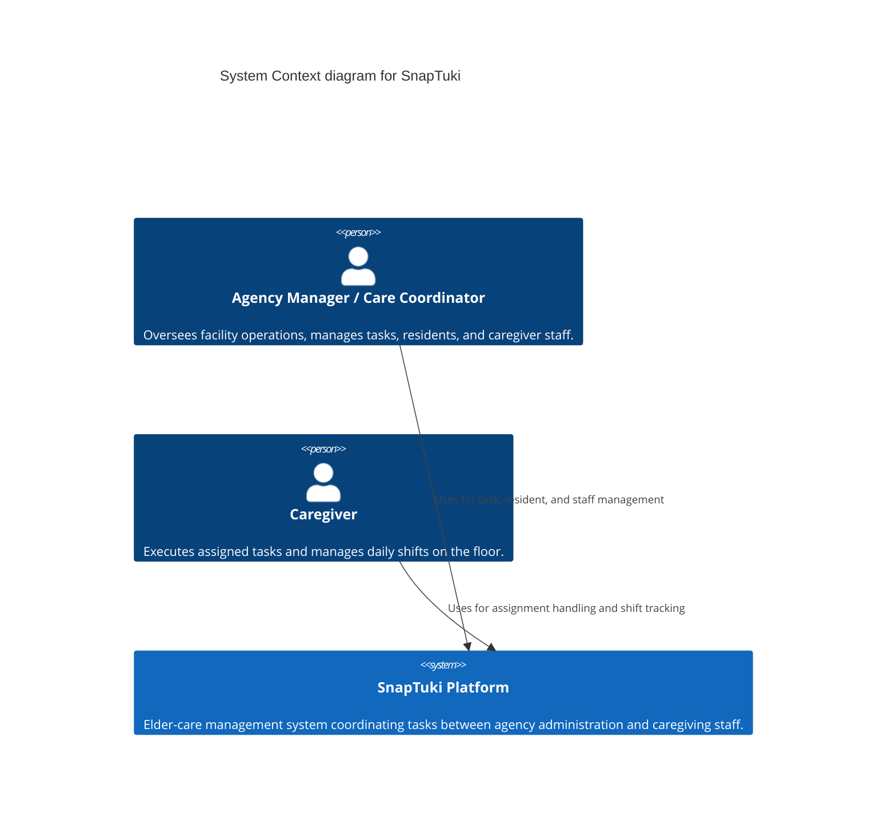
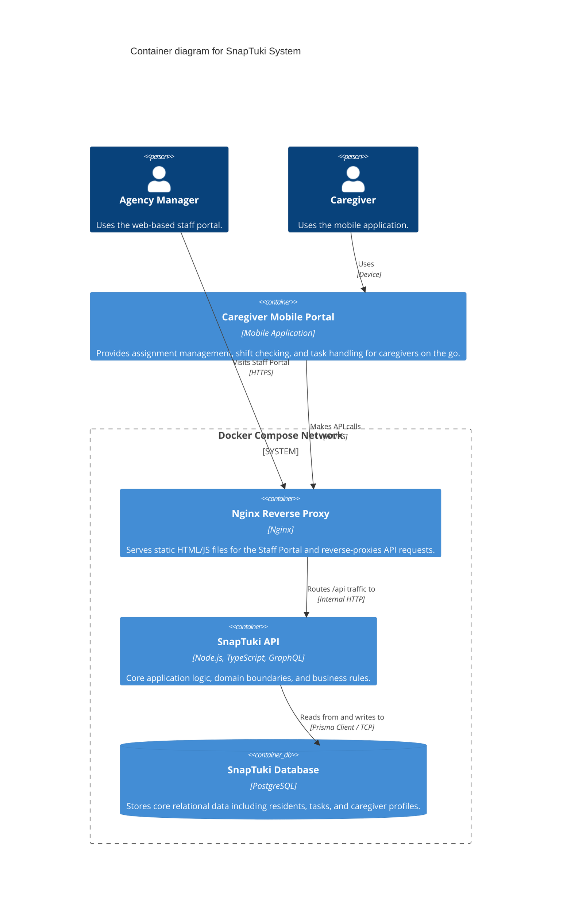

# SnapTuki Architecture

This document outlines the software architecture of the SnapTuki elder-care platform. It follows the [C4 Model](https://c4model.com/) for visualizing software architecture to ensure our system is easily understood by both business stakeholders and technical contributors.

---

## 1. System Context

The System Context provides a high-level, 30,000-foot view of the SnapTuki platform. It defines the core users of the system and how they interact with the primary platform to manage care agency operations.

### Core Actors
* **Care Coordinator / Agency Manager:** Administrative users who rely on the platform to oversee operations. They use the system primarily for task management, resident profile management, and caregiver assignments.
* **Caregiver:** The on-the-ground staff executing the care plans. They interact with the system to handle their specific task assignments, manage their daily workflow within a building, and check their shifts.

### Context Diagram



---

## 2. Container View (Level 2)

The Container View zooms in to the 10,000-foot level, detailing the separately deployable units of the SnapTuki system. 

Our primary infrastructure is orchestrated via **Docker Compose**, establishing an isolated network for our core services.

### Core Containers
* **Nginx (Reverse Proxy):** Acts as the single entry point to our server environment. It is responsible for serving the compiled static HTML/JS files of the Staff Portal (using a feature-matching directory structure) and routing all backend network traffic to the API container.
* **SnapTuki API:** The core backend application container. It exposes a GraphQL interface and encapsulates our Domain-Driven Design (DDD) logic.
* **PostgreSQL Database (`db`):** The persistent data storage layer, tightly integrated with the API container via Prisma.
* **Mobile Portal:** The client-side application used by Caregivers on their mobile devices.

### Container Diagram


---

## 3. Component View (Level 3: SnapTuki API)

The Component View zooms into the `SnapTuki API` container to illustrate its internal structure. 

Because we follow Domain-Driven Design (DDD), we do not diagram individual classes or files. Instead, we map out our **Bounded Contexts**. This ensures that business logic remains strictly encapsulated within its specific domain.

### Core Components
* **GraphQL API Layer:** The entry point for all client requests. It houses our schemas and resolvers, delegating actual business logic to the appropriate domain context.
* **Identity & Access Context:** Manages authentication, authorization (Admin vs. Caregiver permissions), and session security.
* **Task Management Context:** The core operational engine. Handles the creation, assignment, tracking, and completion of care tasks.
* **Resident Management Context:** The system of record for resident profiles, overarching care plans, and medical protocols.
* **Caregiver Management Context:** Manages staff profiles, availability, and shift assignments.
* **Prisma ORM Layer:** A tightly integrated data access layer utilized by all domains to interact with the PostgreSQL database.

### Component Diagram

```mermaid
C4Component
  title Component diagram for SnapTuki API (Bounded Contexts)

  Container_Boundary(api, "SnapTuki API Container") {
    Component(graphql, "GraphQL API Layer", "TypeScript / Node.js", "Provides the unified schema and routes requests to domain services.")
    
    Component(identity, "Identity & Access Context", "DDD Module", "Handles auth, JWTs, and role-based access control.")
    Component(task, "Task Management Context", "DDD Module", "Manages the lifecycle of daily care tasks.")
    Component(resident, "Resident Management Context", "DDD Module", "Manages resident profiles and care plans.")
    Component(caregiver, "Caregiver Management Context", "DDD Module", "Manages staff profiles and shift availability.")
    
    Component(prisma, "Prisma ORM Layer", "Prisma Client", "Provides type-safe database access for all bounded contexts.")
  }
  
  ContainerDb(db, "SnapTuki Database", "PostgreSQL", "Stores all relational application data.")

  Rel(graphql, identity, "Delegates auth requests to")
  Rel(graphql, task, "Delegates task mutations/queries to")
  Rel(graphql, resident, "Delegates resident mutations/queries to")
  Rel(graphql, caregiver, "Delegates staff mutations/queries to")

  Rel(identity, prisma, "Reads/Writes")
  Rel(task, prisma, "Reads/Writes")
  Rel(resident, prisma, "Reads/Writes")
  Rel(caregiver, prisma, "Reads/Writes")
  
  Rel(prisma, db, "Executes queries via TCP")
  ```

  ---

## 3. Architectural Principles & Patterns

To maintain a clean and scalable codebase as SnapTuki grows, developers should adhere to the following established patterns within our containers:

* **Domain-Driven Design (Backend):** The `snaptuki-api` is structured around bounded contexts (e.g., Task Management, Resident Profiles). Business logic should remain encapsulated within these domains.
* **Tightly Integrated ORM:** We utilize Prisma within the API layer to interact with the PostgreSQL database, ensuring type safety and rapid schema iteration.
* **Feature-Matching (Frontend):** The user interface code is organized by feature rather than file type, ensuring that all components, hooks, and styles related to a specific domain are co-located.